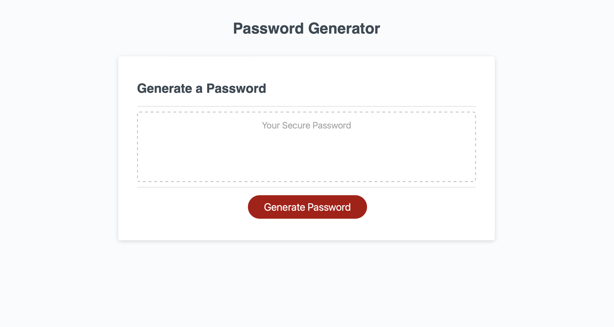
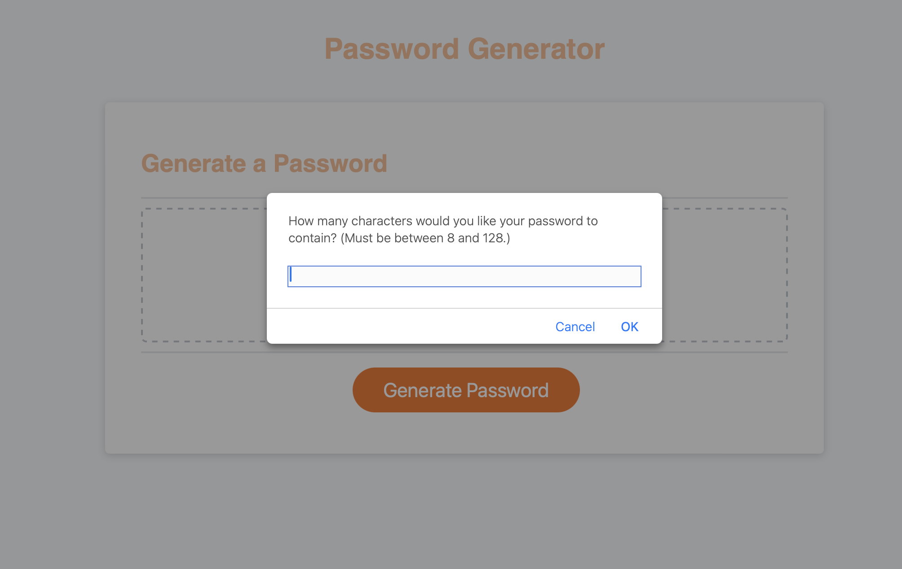

# Challenge 5: Password Generator

## Description

This project focuses on creating a browser-based Password Generator application. It dynamically updates HTML and CSS using JavaScript based on user-selected criteria for password complexity. The generator allows users to specify password length and include a mix of character types: lowercase, uppercase, numeric, and special characters.

### Motivation

The primary goal was to build an application that enhances data security through custom, complex passwords. This challenge demonstrates the practical application of JavaScript in creating responsive and interactive web applications.

### Specific Features

1. Dynamic password length selection (between 8 and 128 characters).
2. Option to include various character types: lowercase, uppercase, numeric, and special characters.
3. Real-time generation of passwords based on user preferences.
4. User-friendly interface with clear instructions and responsive design.

### Technologies Employed

HTML, CSS, JavaScript

## User Story

"As an employee, I want a tool that generates secure, random passwords based on my selected criteria, ensuring robust data protection."

## Usage

Users interact with a simple interface to choose their password criteria. Once selections are made, the application generates a password that appears on the screen. The application ensures a user-friendly experience with a clean, polished UI, adaptable to multiple screen sizes.

### Deployment

This project is deployed and accessible for use. It demonstrates a practical application of JavaScript in creating functional and interactive web utilities.

[Link to the deployed Password Generator application]

### GitHub Repository

The repository is organized following best coding practices. It includes a detailed README and descriptive commit messages, providing insights into the development process.

[Link to the GitHub repository for the Password Generator Challenge]()

## Credits

Resources and tutorials used in the development of this project include:

[Coding Boot Camp: Professional README Guide](https://coding-boot-camp.github.io/full-stack/github/professional-readme-guide);

[MDN Web Docs: JavaScript Documentation](https://developer.mozilla.org/en-US/docs/Web/JavaScript);

[OWASP Foundation: Special Characters](https://www.owasp.org/index.php/Password_special_characters);

[Programiz: JavaScript Examples - Get Random Item](https://www.programiz.com/javascript/examples/get-random-item);

[Stack Overflow: How to get random value from an array](https://stackoverflow.com/questions/26165455/how-to-get-random-value-from-an-array);

[W3Schools: JavaScript Tutorial](https://www.w3schools.com/js/).

## Licence

Refer to the LICENSE in the repo.

## Badges

